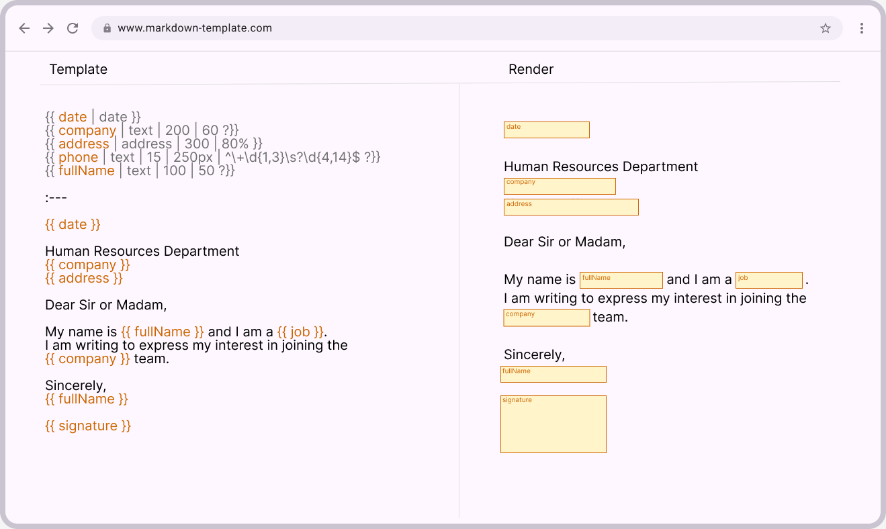

# 📄 Especificación Técnica: Sistema Dinámico de Plantillas Markdown (Modelo Mustache Ampliado)

<div align="center">
  
</div>

## 1. Objetivo

Definir el formato estándar para la creación de **plantillas Markdown dinámicas** mediante una sintaxis **Mustache ampliada**.
Este formato permite el uso de variables con tipo, longitud máxima, ancho visual, indicador de obligatoriedad y validación mediante **expresiones regulares (`regex`)**, además de admitir variables no declaradas previamente.

El sistema debe:

* Separar las definiciones de variables del cuerpo del documento.
* Soportar variables **implícitas (no declaradas)**.
* Validar propiedades como longitud máxima, ancho visual, obligatoriedad y patrón de `regex`.
* Mantener total compatibilidad con la sintaxis Markdown.

---

## 2. Estructura General del Archivo

Cada plantilla Markdown consta de **dos secciones**, separadas por una línea que contiene únicamente:

```
:---
```

### Estructura:

```
[SECCIÓN 1: Definiciones de Variables]
:---
[SECCIÓN 2: Contenido de la Plantilla]
```

### Ejemplo General:

```md
:---

{{ variable | tipo | longitud | ancho | regex }}
{{ otraVariable | tipo }}

:---

Texto que utiliza {{ variable }} y {{ otraVariable }}.
```

---

## 3. Sección 1 — Definiciones de Variables

Esta sección contiene la lista de variables usadas o previstas en la plantilla.
Cada línea define una variable mediante la siguiente sintaxis:

```
{{ nombreVariable | tipo | longitud | ancho | regex | clave=valor | clave=valor }}
```

El primer segmento siempre es el **nombre de la variable**, seguido de parámetros posicionales (`tipo`, `longitud`, `ancho`, `regex`).
Luego pueden añadirse atributos nombrados como `clave=valor` para mantener una sintaxis expresiva y legible.

### Parámetros

| Parámetro        | Descripción                                                                                                                                              | Obligatorio |
| ---------------- | -------------------------------------------------------------------------------------------------------------------------------------------------------- | ----------- |
| `nombreVariable` | Identificador único de la variable. No puede contener espacios ni guiones bajos (`_`). Usar *camelCase* para nombres compuestos (ej.: `nombreCompleto`). | ✅           |
| `tipo`           | Tipo de campo (`text`, `textarea`, `date`, `select`, etc.).                                                                                              | ✅           |
| `longitud`       | Cantidad máxima de caracteres permitidos.                                                                                                                | Opcional    |
| `ancho`          | Ancho visual mínimo del campo (soporta unidades CSS).                                                                                                    | Opcional    |
| `regex`          | Expresión regular que define el formato válido de entrada.                                                                                               | Opcional    |
| `clave=valor`    | Atributos nombrados adicionales (ej.: `height=40px`, `format=DD/MM/YYYY`).                                                                               | Opcional    |

---

### 3.1. Campos Obligatorios

Un campo se considera **obligatorio** si su definición termina con un espacio seguido de `?}}`.

#### Ejemplos válidos:

```
{{ empresa | text | 200 | 60 ?}}
{{ direccion | textarea | 400 | 80% ?}}
{{ email | text | 255 | 40em | ^[\w.%+-]+@[\w.-]+\.[A-Za-z]{2,}$ ?}}
{{ telefono | text | 15 | 200px | ^\+\d{1,3}\s?\d{4,14}$ ?}}
```

#### Reglas:

* Debe haber **un espacio entre el último parámetro y el `?`**.
  Ejemplo: `| 60 ?}}` o `| 80% ?}}`
* El campo debe marcarse como obligatorio al renderizar el formulario.
* La interfaz puede indicar visualmente los campos requeridos (ej.: etiqueta “(obligatorio)” o color).
* Si un campo obligatorio está vacío o no cumple con el patrón `regex`, se debe bloquear la generación del documento.

---

### 3.2. Dimensiones Visuales (`width`, `height`)

* `width` define el **ancho visual mínimo** del campo en el formulario.
* `height` controla la **altura visual mínima** para campos multilinea o componentes (ej.: `textarea`, `select`).
* Ambas aceptan valores numéricos o **unidades CSS válidas** (`px`, `%`, `em`, `rem`, `vh`, etc.) y solo afectan al diseño, no a la longitud de texto.

#### Ejemplos:

```
{{ empresa | text | 200 | 60 }}
{{ telefono | text | 15 | 250px }}
{{ direccion | textarea | 400 | 90% | height=160px }}
{{ estadoPago | select | [pendiente:Pendiente, pagado:Pagado, rechazado:Rechazado] | 40 | height=3.5rem ?}}
{{ comentario | textarea | 500 | 40em | height=12rem ?}}
```

---

### 3.3. Parámetro `length`

* Especifica el **máximo número de caracteres** permitidos en un campo.
* Se usa como regla de validación `maxlength`.
* Si no se define, el valor por defecto es 255 para `text`, o ilimitado para `textarea`.

#### Ejemplos:

```
{{ empresa | text | 200 }}
{{ descripcion | textarea | 500 | 80% }}
```

---

### 3.4. Parámetro `regex`

* Define una **expresión regular** que el valor de entrada debe cumplir para ser válido.
* Útil para validaciones de formato (ej.: correos, teléfonos, IPs).
* **No requiere delimitadores** (`/ /`), solo la expresión pura.

#### Ejemplos:

```
{{ email | text | 255 | 60 | ^[\w.%+-]+@[\w.-]+\.[A-Za-z]{2,}$ }}
{{ telefono | text | 15 | 200px | ^\+\d{1,3}\s?\d{4,14}$ ?}}
{{ ip | text | 15 | 200px | ^(?:\d{1,3}\.){3}\d{1,3}$ }}
{{ codigoPostal | text | 5 | 60 | ^\d{5}$ ?}}
```

#### Reglas:

* El valor debe **coincidir completamente** con el patrón.
* Si se define `regex` y la validación falla, el campo se considera inválido.
* Puede combinarse con otros parámetros (`length`, `width`, `?`).

---

### 3.5. Ejemplo Completo de Definición

```
{{ fecha | date | format=DD/MM/YYYY }}
{{ empresa | text | 200 | 60 ?}}
{{ direccion | textarea | 400 | 90% | height=160px }}
{{ email | text | 255 | 60 | ^[\w.%+-]+@[\w.-]+\.[A-Za-z]{2,}$ ?}}
{{ telefono | text | 15 | 250px | ^\+\d{1,3}\s?\d{4,14}$ | format=e164 ?}}
{{ estadoPago | select | [pendiente:Pendiente, pagado:Pagado, rechazado:Rechazado] | 40 | height=3.5rem | default=Pendiente }}
{{ ip | text | 15 | 200px | ^(?:\d{1,3}\.){3}\d{1,3}$ }}
{{ nombreCompleto | text | 100 | 50 ?}}
```

---

### 3.6. Opciones `select` (`type = select`)

* Usa el tercer parámetro para declarar la lista de opciones en un **arreglo** con el formato `[clave:valor, clave:valor, ...]`.
* Cada `clave` es el valor enviado; `valor` es el texto visible en el formulario.
* Se pueden añadir parámetros como `width` o `?`. `regex` no aplica a campos `select`.

#### Ejemplo:

```
{{ estadoPago | select | [pendiente:Pendiente, pagado:Pagado, rechazado:Rechazado] | 40 ?}}
```

> El ejemplo anterior genera un menú con tres opciones y marca el campo como obligatorio, con ancho mínimo de `40`.

---

### 3.7. Atributos Nombrados (`format`, `default`, ...)

* Los atributos nombrados usan la sintaxis `clave=valor`, inspirada en etiquetas de PDF embebido (ej.: DocuSeal).
* Pueden aparecer tras cualquier parámetro posicional.
* Los tokens con `=` son tratados como pares clave/valor sin importar el orden.
* Atributos no reconocidos deben almacenarse para posibles usos posteriores.

#### Atributos comunes

| Atributo      | Aplica a                                           | Ejemplo                                                                            | Notas                                                                                 |
| ------------- | -------------------------------------------------- | ---------------------------------------------------------------------------------- | ------------------------------------------------------------------------------------- |
| `format`      | `date`, `number`, `currency`, `phone`, `signature` | `format=DD/MM/YYYY`, `format=currency:usd`, `format=e164`, `format=drawn_or_typed` | Se recomienda seguir patrones humanos para fechas y prefijos para formatos complejos. |
| `default`     | Cualquier entrada                                  | `default=Pendiente`                                                                | Prellena el campo sin impedir ediciones.                                              |
| `placeholder` | Entradas de texto                                  | `placeholder=Escriba su nombre completo`                                           | Texto guía mostrado en el formulario, no incluido en la salida final.                 |
| `readonly`    | Cualquier entrada                                  | `readonly=true`                                                                    | Campo bloqueado; útil para valores calculados o externos.                             |

> Los nombres de atributos deben ir en minúsculas, y los valores sin comillas. Para dimensiones usar unidades CSS (`px`, `rem`, `%`, etc.).

#### Recomendaciones para `format`

* **Fechas:** soportar tokens como `YYYY-MM-DD`, `DD/MM/YYYY`, `MMMM D, YYYY`.
* **Números y moneda:** usar `currency:<código>` (ej.: `currency:usd`, `currency:eur`) o `percentage`.
* **Teléfonos:** preferir `format=e164` para forzar prefijos con `+`.
* **Firmas:** restringido a `drawn`, `typed`, `drawn_or_typed`, o `upload`.


Continuando con la traducción desde la **Sección 4**:

---

## 4. Sección 2 — Contenido de la Plantilla

Después del separador `:---`, se define el cuerpo Markdown del documento.
Aquí se pueden usar las variables declaradas en la primera sección, así como nuevas variables en línea.

### Formas válidas:

1. **Uso simple:**

   ```
   {{ variable }}
   ```
2. **Uso extendido en línea:**

   ```
   {{ variable | tipo | longitud | ancho | regex | clave=valor }}
   ```
3. **Campo requerido en línea:**

   ```
   {{ variable | tipo | longitud | ancho | regex | clave=valor ?}}
   ```

---

### 4.1. Variables No Declaradas en el Encabezado

Las variables utilizadas en el cuerpo y **no listadas** en el encabezado se consideran **implícitas** y se generan automáticamente con valores por defecto.

| Propiedad  | Valor por defecto            |
| ---------- | ---------------------------- |
| `type`     | `text`                       |
| `length`   | ilimitado                    |
| `width`    | tamaño por defecto (ej.: 40) |
| `height`   | auto                         |
| `regex`    | ninguna                      |
| `format`   | ninguno                      |
| `default`  | `null`                       |
| `required` | `false`                      |

#### Ejemplos válidos:

```
{{ firma }}
{{ firma | text }}
{{ firma | text | 200 | 80 }}
```

> Aunque se permiten definiciones en línea, se recomienda declararlas en el encabezado para mayor claridad.

---

## 5. Ejemplo Completo de Plantilla Markdown

```md
{{ fecha | date | format=DD/MM/YYYY }}
{{ empresa | text | 200 | 60 ?}}
{{ direccion | textarea | 400 | 90% | height=160px }}
{{ email | text | 255 | 60 | ^[\w.%+-]+@[\w.-]+\.[A-Za-z]{2,}$ ?}}
{{ telefono | text | 15 | 250px | ^\+\d{1,3}\s?\d{4,14}$ | format=e164 ?}}
{{ estadoPago | select | [pendiente:Pendiente, pagado:Pagado, rechazado:Rechazado] | 40 | height=3.5rem | default=Pendiente }}
{{ nombreCompleto | text | 100 | 50 ?}}

:---

{{ fecha }}

Departamento de Recursos Humanos
{{ empresa }}
{{ direccion }}

Puede contactarme a través de {{ email }} o {{ telefono }} para más información.

Estimado/a:

Mi nombre es {{ nombreCompleto }} y soy {{ cargo }}.
Escribo para expresar mi interés en formar parte del equipo de {{ empresa }}.

Estado actual: {{ estadoPago }}.

Atentamente,
{{ nombreCompleto }}

{{ firma }}
```

> En este ejemplo, `firma` no está definida en el encabezado, por lo tanto, se trata como una **variable implícita** de tipo `text`.

---

## 6. Ejemplo de Estructura Analizada (Salida Esperada)

```json
[
  {"variable": "fecha", "type": "date", "length": null, "width": null, "height": null, "regex": null, "format": "DD/MM/YYYY", "default": null, "required": false},
  {"variable": "empresa", "type": "text", "length": 200, "width": "60", "height": null, "regex": null, "format": null, "default": null, "required": true},
  {"variable": "direccion", "type": "textarea", "length": 400, "width": "90%", "height": "160px", "regex": null, "format": null, "default": null, "required": false},
  {"variable": "email", "type": "text", "length": 255, "width": "60", "height": null, "regex": "^[\\w.%+-]+@[\\w.-]+\\.[A-Za-z]{2,}$", "format": null, "default": null, "required": true},
  {"variable": "telefono", "type": "text", "length": 15, "width": "250px", "height": null, "regex": "^\\+\\d{1,3}\\s?\\d{4,14}$", "format": "e164", "default": null, "required": true},
  {"variable": "estadoPago", "type": "select", "length": null, "width": "40", "height": "3.5rem", "regex": null, "format": null, "default": "Pendiente", "required": false, "options": [{"key": "pendiente", "value": "Pendiente"}, {"key": "pagado", "value": "Pagado"}, {"key": "rechazado", "value": "Rechazado"}]},
  {"variable": "ip", "type": "text", "length": 15, "width": "200px", "height": null, "regex": "^(?:\\d{1,3}\\.){3}\\d{1,3}$", "format": null, "default": null, "required": false},
  {"variable": "nombreCompleto", "type": "text", "length": 100, "width": "50", "height": null, "regex": null, "format": null, "default": null, "required": true},
  {"variable": "firma", "type": "text", "length": null, "width": null, "height": null, "regex": null, "format": null, "default": null, "required": false}
]
```

---

## 7. Tipos de Campo Soportados

| Tipo       | Descripción                               | Ejemplo                                       |
| ---------- | ----------------------------------------- | --------------------------------------------- |
| `text`     | Campo de texto en una sola línea.         | `"Telelejos SA"`                              |
| `textarea` | Campo de texto multilínea.                | `"Soy una persona motivada y trabajadora..."` |
| `date`     | Selector de fechas.                       | `"2025-10-17"`                                |
| `number`   | Campo numérico.                           | `"25"`                                        |
| `email`    | Correo electrónico.                       | `"laura@ejemplo.com"`                         |
| `address`  | Dirección o texto largo.                  | `"Avenida Cóndor 8"`                          |
| `select`   | Campo desplegable con opciones definidas. | `"pendiente" → "Pendiente"`                   |
| `boolean`  | Casilla de verificación (sí/no).          | `true` / `false`                              |

**Nota:** El sistema debe poder admitir futuros tipos de campo como `phone`, `url`, `currency`, `signature`, etc.

---

## 8. Reglas de Validación

### Estructura

* El documento debe contener un único separador `:---` entre el encabezado y el cuerpo.
* Si se omite la sección de encabezado, siguen siendo válidas las definiciones en línea.
* El contenido debe ser Markdown válido.

### Variables

* Los nombres de variables deben usar **camelCase** — no se permiten guiones bajos (`_`).
* Los parámetros se separan con `|` (el espacio se ignora).
* Los campos obligatorios terminan con un espacio y `?}}`.
* `width` y `height` aceptan unidades compatibles con CSS.
* `regex` define los patrones de formato (sin delimitadores).
* Los atributos nombrados (`clave=valor`) pueden colocarse en cualquier orden; se deben registrar incluso si no son reconocidos.
* `format` define cómo se muestra o valida el dato (ej.: `DD/MM/YYYY`, `currency:usd`, `drawn_or_typed`).
* Las variables no definidas se crean automáticamente con valores predeterminados.

### Sustitución

* Todas las ocurrencias de una variable comparten el mismo valor.
* Si un campo obligatorio (`?`) está vacío o no cumple con su `regex`, se debe cancelar la generación del documento.
* Se debe conservar el formato y estilo Markdown original.

---

## 9. Comportamiento Esperado del Sistema

1. **Análisis**

   * Detecta todas las variables en ambas secciones.
   * Construye un esquema JSON con propiedades (`type`, `length`, `width`, `regex`, `required`, etc.).
   * Asigna valores por defecto a las variables implícitas.

2. **Renderizado Dinámico del Formulario**

   * Genera los campos del formulario según el tipo de cada variable.
   * Aplica validaciones y sugerencias de presentación (`maxlength`, `required`, `width`, `height`, `regex`, `format`, `default`, etc.).
   * Interpreta correctamente unidades CSS y directivas semánticas (`currency`, `date`, `signature`, etc.).

3. **Renderizado Final**

   * Sustituye los marcadores por los valores proporcionados por el usuario.
   * Preserva el formato Markdown original.
   * Permite exportación en `.md`, `.html` o `.pdf`.

