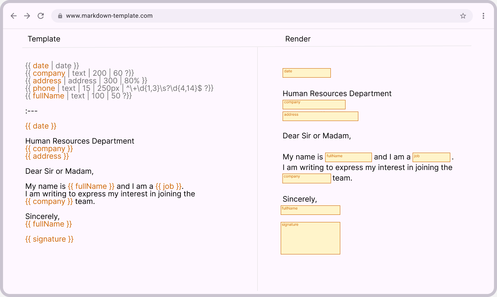

# Markdown Template
# 📄 Technical Specification: Dynamic Markdown Template System (Extended Mustache Model)

<div align="center">
  
</div>

## 1. Objective

Define the standard format for creating **dynamic Markdown templates** using an extended **Mustache** syntax.
This format allows variables with type, maximum length, visual width, required flag, and **regular expression (`regex`) validation**, while also supporting variables not declared in advance.

The system must:

- Separate variable definitions from the document body.
- Support **implicit (undeclared)** variables.
- Validate field properties such as maximum length, visual width, required status, and regex pattern.
- Maintain full compatibility with Markdown syntax.

---

## 2. General File Structure

Each Markdown template consists of **two sections**, separated by a single line containing only:

```
:---
```

### Structure:

```
[SECTION 1: Variable Definitions]
:---
[SECTION 2: Template Content]
```

### General Example:

```md
:---

{{ variable | type | length | width | regex }}
{{ anotherVariable | type }}

:---

Text using {{ variable }} and {{ anotherVariable }}.
```

---

## 3. Section 1 — Variable Definitions

This section contains the list of variables used or anticipated in the template.
Each line defines one variable using the following syntax:

```
{{ variableName | type | length | width | regex | key=value | key=value }}
```

The first segment is always the **variable name**, followed by positional parameters (`type`, `length`, `width`, `regex`).
Additional named attributes can be appended afterwards as `key=value` pairs to keep the syntax expressive yet readable.

### Parameters

|Parameter|Description|Required|
|---|---|---|
|`variableName`|Unique variable identifier. Cannot contain spaces or underscores (`_`). Use *camelCase* for multi-word names (e.g., `fullName`).|✅|
|`type`|Field type (`text`, `textarea`, `date`, `select`, etc.).|✅|
|`length`|Maximum number of allowed characters.|Optional|
|`width`|Minimum visual width of the field (supports CSS units).|Optional|
|`regex`|Regular expression defining the valid input format.|Optional|
|`key=value`|Additional named attributes (e.g., `height=40px`, `format=DD/MM/YYYY`).|Optional|

---

### 3.1. Required Fields

A field is considered **required** if its definition ends with a space followed by `?}}`.

#### Valid examples:

```
{{ company | text | 200 | 60 ?}}
{{ address | textarea | 400 | 80% ?}}
{{ email | text | 255 | 40em | ^[\w.%+-]+@[\w.-]+\.[A-Za-z]{2,}$ ?}}
{{ phone | text | 15 | 200px | ^\+\d{1,3}\s?\d{4,14}$ ?}}
```

#### Rules:

- There must be **a space between the last parameter and the `?`**.
  Example: `| 60 ?}}` or `| 80% ?}}`
- The field must be marked as `required` when rendered in the form.
- The interface may visually indicate required fields (e.g., “(required)” label or color).
- If a required field is empty or fails the `regex` pattern, the system must block document generation.

---

### 3.2. Visual Dimensions (`width`, `height`)

- `width` defines the **minimum visual width** of the input in the form.
- `height` controls the **minimum visual height** for multiline or component-based fields (e.g., `textarea`, `select`).
- Both accept numeric values or **valid CSS units** (`px`, `%`, `em`, `rem`, `vh`, etc.) and affect layout only — not the text length limit.

#### Examples:

```
{{ company | text | 200 | 60 }}
{{ phone | text | 15 | 250px }}
{{ address | textarea | 400 | 90% | height=160px }}
{{ paymentStatus | select | [pending:Pending, paid:Paid, rejected:Rejected] | 40 | height=3.5rem ?}}
{{ comment | textarea | 500 | 40em | height=12rem ?}}
```

---

### 3.3. Parameter `length`

- Specifies the **maximum number of characters** allowed for a field.
- Used as a `maxlength` validation rule.
- If not defined, the default value is 255 for `text`, or unlimited for `textarea`.

#### Examples:

```
{{ company | text | 200 }}
{{ description | textarea | 500 | 80% }}
```

---

### 3.4. Parameter `regex`

- Defines a **regular expression** that the input value must match to be valid.
- Useful for pattern validation (e.g., emails, phone numbers, IPs).
- Does **not** require delimiters (`/ /`), only the raw regex expression.

#### Examples:

```
{{ email | text | 255 | 60 | ^[\w.%+-]+@[\w.-]+\.[A-Za-z]{2,}$ }}
{{ phone | text | 15 | 200px | ^\+\d{1,3}\s?\d{4,14}$ ?}}
{{ ipAddress | text | 15 | 200px | ^(?:\d{1,3}\.){3}\d{1,3}$ }}
{{ postalCode | text | 5 | 60 | ^\d{5}$ ?}}
```

#### Rules:

- The input value must **fully match** the regex pattern.
- If `regex` is defined and validation fails, the field is considered invalid.
- `regex` can be combined with other parameters (`length`, `width`, `?`).

---

### 3.5. Complete Variable Header Example

```
{{ date | date | format=DD/MM/YYYY }}
{{ company | text | 200 | 60 ?}}
{{ address | textarea | 400 | 90% | height=160px }}
{{ email | text | 255 | 60 | ^[\w.%+-]+@[\w.-]+\.[A-Za-z]{2,}$ ?}}
{{ phone | text | 15 | 250px | ^\+\d{1,3}\s?\d{4,14}$ | format=e164 ?}}
{{ paymentStatus | select | [pending:Pending, paid:Paid, rejected:Rejected] | 40 | height=3.5rem | default=Pending }}
{{ ipAddress | text | 15 | 200px | ^(?:\d{1,3}\.){3}\d{1,3}$ }}
{{ fullName | text | 100 | 50 ?}}
```

---

### 3.6. Select Options (`type = select`)

- Use the third parameter to declare the list of selectable options as an **array** following the format `[key:value, key:value, ...]`.
- Each `key` is the submitted data, while `value` is the human-readable caption rendered in the form.
- Additional parameters such as `width` or the required marker (`?`) can still be appended as usual. `regex` is not applied to select fields.

#### Example:

```
{{ paymentStatus | select | [pending:Pending, paid:Paid, rejected:Rejected] | 40 ?}}
```

> The example above renders a select input with three options and marks the field as required while keeping a minimum visual width of `40`.

---

### 3.7. Named Attributes (`format`, `default`, ...)

- Named attributes use the `key=value` syntax inspired by embedded PDF tags (e.g., DocuSeal) while keeping the template readable.
- They can appear after any positional parameter. The parser treats tokens containing `=` as name/value pairs regardless of order.
- Unrecognized attributes should be stored so renderers can choose to honor them or expose them downstream.

#### Common attributes

|Attribute|Applies to|Example|Notes|
|---|---|---|---|
|`format`|`date`, `number`, `currency`, `phone`, `signature`|`format=DD/MM/YYYY`, `format=currency:usd`, `format=e164`, `format=drawn_or_typed`|Use human-readable patterns for dates, prefixed namespaces for complex cases (`currency:usd`). Aligns with parsing conventions from DocuSeal-style tags, but remains optional here.|
|`default`|Any input|`default=Pending`|Pre-populates form fields while still allowing user edits unless combined with `readonly=true`.|
|`placeholder`|Text inputs|`placeholder=Enter full name`|Displayed hint text in the UI, ignored in final output.|
|`readonly`|Any input|`readonly=true`|Locks the field; useful for computed or externally managed values.|

> Keep attribute names lowercase and values without surrounding quotes. Use CSS units (`px`, `rem`, `%`, etc.) for size-related attributes.

#### `format` recommendations

- **Dates:** support tokens such as `YYYY-MM-DD`, `DD/MM/YYYY`, or `MMMM D, YYYY`.
- **Numbers & currency:** use `currency:<code>` (e.g., `currency:usd`, `currency:eur`) or `percentage` for percent-style rendering.
- **Phone numbers:** prefer `format=e164` to ensure the `+` country prefix is enforced.
- **Signatures:** restrict to `drawn`, `typed`, `drawn_or_typed`, or `upload` to mirror signer experience options.

## 4. Section 2 — Template Content

After the `:---` separator, the Markdown body of the document is defined.
Variables declared in the first section, as well as new inline variables, may be used here.

### Valid forms:

1. **Simple use:**
    ```
    {{ variable }}
    ```
2. **Extended inline use:**
    ```
  {{ variable | type | length | width | regex | key=value }}
    ```
3. **Required inline field:**
    ```
  {{ variable | type | length | width | regex | key=value ?}}
    ```

---

### 4.1. Variables Not Defined in the Header

Variables used in the body that **are not listed** in the header are considered **implicit** and automatically generated with default values.

|Property|Default value|
|---|---|
|`type`|`text`|
|`length`|unlimited|
|`width`|default size (e.g., 40)|
|`height`|auto|
|`regex`|none|
|`format`|none|
|`default`|`null`|
|`required`|`false`|

#### Valid examples:

```
{{ signature }}
{{ signature | text }}
{{ signature | text | 200 | 80 }}
```

> Although inline variable definitions are allowed, declaring them in the header is recommended for clarity.

---

## 5. Full Markdown Template Example

```md
{{ date | date | format=DD/MM/YYYY }}
{{ company | text | 200 | 60 ?}}
{{ address | textarea | 400 | 90% | height=160px }}
{{ email | text | 255 | 60 | ^[\w.%+-]+@[\w.-]+\.[A-Za-z]{2,}$ ?}}
{{ phone | text | 15 | 250px | ^\+\d{1,3}\s?\d{4,14}$ | format=e164 ?}}
{{ paymentStatus | select | [pending:Pending, paid:Paid, rejected:Rejected] | 40 | height=3.5rem | default=Pending }}
{{ fullName | text | 100 | 50 ?}}

:---

{{ date }}

Human Resources Department
{{ company }}
{{ address }}

You can reach me at {{ email }} or {{ phone }} for any further information.

Dear Sir or Madam,

My name is {{ fullName }} and I am a {{ job }}.
I am writing to express my interest in joining the {{ company }} team.

Current status: {{ paymentStatus }}.

Sincerely,
{{ fullName }}

{{ signature }}
```

> In this example, `signature` is not defined in the header, so it is treated as an **implicit variable** of type `text`.

---

## 6. Example of Parsed Structure (Expected Output)

```json
[
  {"variable": "date", "type": "date", "length": null, "width": null, "height": null, "regex": null, "format": "DD/MM/YYYY", "default": null, "required": false},
  {"variable": "company", "type": "text", "length": 200, "width": "60", "height": null, "regex": null, "format": null, "default": null, "required": true},
  {"variable": "address", "type": "textarea", "length": 400, "width": "90%", "height": "160px", "regex": null, "format": null, "default": null, "required": false},
  {"variable": "email", "type": "text", "length": 255, "width": "60", "height": null, "regex": "^[\\w.%+-]+@[\\w.-]+\\.[A-Za-z]{2,}$", "format": null, "default": null, "required": true},
  {"variable": "phone", "type": "text", "length": 15, "width": "250px", "height": null, "regex": "^\\+\\d{1,3}\\s?\\d{4,14}$", "format": "e164", "default": null, "required": true},
  {"variable": "paymentStatus", "type": "select", "length": null, "width": "40", "height": "3.5rem", "regex": null, "format": null, "default": "Pending", "required": false, "options": [{"key": "pending", "value": "Pending"}, {"key": "paid", "value": "Paid"}, {"key": "rejected", "value": "Rejected"}]},
  {"variable": "ipAddress", "type": "text", "length": 15, "width": "200px", "height": null, "regex": "^(?:\\d{1,3}\\.){3}\\d{1,3}$", "format": null, "default": null, "required": false},
  {"variable": "fullName", "type": "text", "length": 100, "width": "50", "height": null, "regex": null, "format": null, "default": null, "required": true},
  {"variable": "signature", "type": "text", "length": null, "width": null, "height": null, "regex": null, "format": null, "default": null, "required": false}
]
```

---

## 7. Supported Field Types

|Type|Description|Example|
|---|---|---|
|`text`|Single-line text input.|`"Telelejos SA"`|
|`textarea`|Multi-line text input.|`"I am a motivated and hardworking person..."`|
|`date`|Date selector.|`"2025-10-17"`|
|`number`|Numeric input.|`"25"`|
|`email`|Email address.|`"laura@example.com"`|
|`address`|Address or long text.|`"Condor Avenue 8"`|
|`select`|Select input backed by an options array in the format `[key:value, ...]`.|`"pending" → "Pending"`|
|`boolean`|Checkbox (yes/no).|`true` / `false`|

**Note:** The system should support additional future field types such as `phone`, `url`, `currency`, `signature`, etc.

---

## 8. Validation Rules

### Structure
- The document must contain a single `:---` separator between the variable header and the body.
- If the header section is omitted, inline variable definitions remain valid.
- The content must be valid Markdown.

### Variables
- Variable names must use **camelCase** — underscores (`_`) are not allowed.
- Parameters are separated by `|` (whitespace ignored).
- Required fields end with a space and `?}}`.
- `width` accepts CSS-compatible units (`px`, `%`, `em`, `rem`, `vw`, etc.).
- `height` accepts the same CSS-compatible units and controls the vertical footprint of form controls.
- `regex` defines formatting patterns (no delimiters).
- Named attributes using `key=value` can be appended in any order after the positional parameters; parsers should capture unknown keys for extensibility.
- `format` refines how data is displayed or validated (e.g., `DD/MM/YYYY`, `currency:usd`, `drawn_or_typed`).
- Undefined variables are created automatically with default settings.

### Replacement
- All occurrences of the same variable share the same value.
- If a required variable (`?`) is empty or fails regex validation, document generation must stop.
- Markdown formatting, spacing, and line breaks must be preserved.

---

## 9. Expected System Behavior

1. **Parsing**
   - Detects all variables across both sections.
   - Builds a JSON schema with properties (`type`, `length`, `width`, `regex`, `required`).
   - Assigns default values to implicit variables.

2. **Dynamic Form Rendering**
   - Generates form inputs based on variable types.
  - Applies validations and presentation hints (`maxlength`, `required`, `width`, `height`, `regex`, `format`, `default`, etc.).
  - Properly interprets CSS-based units for size as well as semantic format directives (dates, currency, phone, signature).

3. **Final Rendering**
   - Replaces placeholders with user-provided values.
   - Maintains full Markdown formatting and style.
   - Supports exporting as `.md`, `.html`, or `.pdf`.
